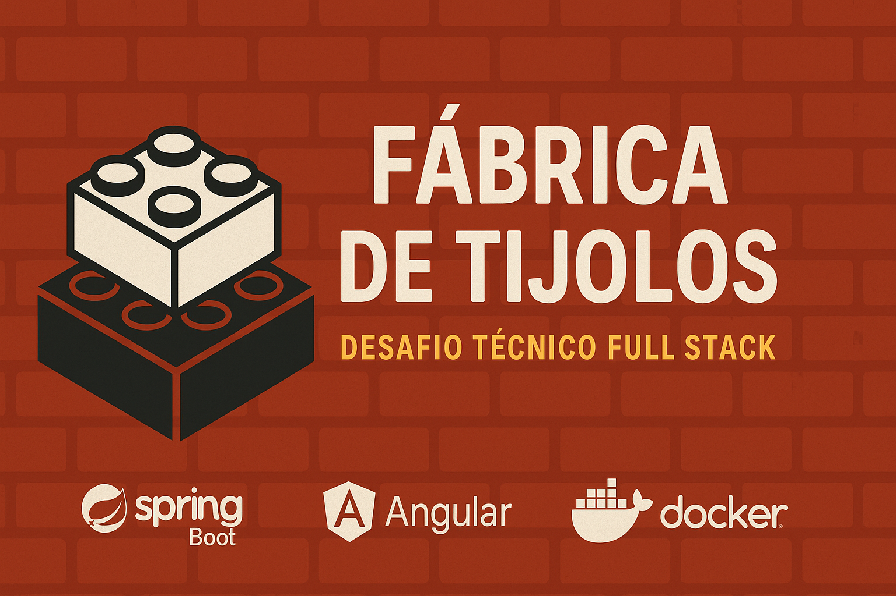

# 🧱 Fábrica de Tijolos - Java Spring Boot



Este repositório contém a solução completa para o desafio técnico proposto pela **GRB** para vaga de desenvolvedor full stack. A aplicação simula uma fábrica de tijolos, com funcionalidades completas de CRUD, filtragem, relatório estatístico e execução via Docker.

---

## 🚀 Tecnologias Utilizadas

- **Java 17**
- **Spring Boot 3.2.5**
- **JPA / Hibernate**
- **MySQL 8**
- **Angular (frontend - repositório separado)**
- **Docker & Docker Compose**
- **JUnit 5 / Mockito**
- **Lombok**

---

## ⚙️ Como Executar o Projeto

### 🐳 Opção 1 — Rodar com Docker (recomendado)

> Requer Docker Desktop instalado com WSL 2 ativado.

```bash
docker compose up --build
```

---

### 🔁 Opção 2 — Rodar localmente com Maven (sem Docker)

```bash
mvn clean package -DskipTests
java -jar target/fabrica-tijolos-1.0.0.jar
```

Acesse o backend em:  
📍 [http://localhost:8080/tijolos](http://localhost:8080/tijolos)

---

## 📊 Funcionalidades Implementadas

✅ Geração automática de 100 tijolos ao iniciar  
✅ Status: `EM_INSPECAO`, `APROVADO`, `REPROVADO`  
✅ Regra de 1 em 3 tijolos aprovados com defeito oculto  
✅ Filtros por cor, status e defeituoso  
✅ Exclusão apenas de tijolos defeituosos  
✅ Relatório estatístico completo:
- Tijolos por cor e quantidade de furos (pares/ímpares)
- Totais por status
- Total com defeito

---

## 📁 Estrutura do Projeto

```bash
fabrica-tijolos/
├── src/
├── pom.xml
├── docker-compose.yml
├── Dockerfile
├── application.properties
└── README.md
```

---

## 📝 Observações e Diferenciais

- Projeto preparado para rodar com Docker e MySQL isolado  
- Separação clara entre camadas (`controller`, `service`, `DTO`, `model`)  
- Uso de `@ControllerAdvice` para tratamento global de erros  
- Uso de `DTO` + Bean Validation com mensagens personalizadas  
- Testes unitários com JUnit + Mockito para regras de negócio  
- Documentação limpa e orientada ao avaliador

---

## 🌐 Frontend Angular

Este backend é consumido pelo frontend Angular disponível em:  
👉 [https://github.com/NCS-DEVX/fabrica-tijolos-frontend](https://github.com/NCS-DEVX/fabrica-tijolos-frontend)

---

## 👨‍💻 Autor

**Nathan Silva**  
Candidato à vaga de Desenvolvedor Full Stack na GRB
